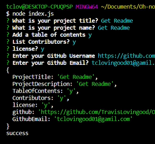

# Oh Node ReadMe



## Description

To give a project creator more time to work on a project, I have made a command-line application that will allow for  
easy generation of a project README. This README will be populated with information about the app like how to use it, how to install it, how to report
issues, and how to make contributions

## Table of Contents 


* [Usage](#usage)

* [License](#license)

* [Contributing](#contributing)


* [Questions](#questions)


## Usage

```
In your terminal enter npm install.

Then enter npm start.
```

## License

This project is licensed under the Oh Yeah License.
  
## Contributing

Travis Lovingood

## Questions

If you have any questions about the repo, open an issue or contact [Oh-node-readme](https://github.com/TravisLovingood/Oh-node-readme) directly at undefined.
